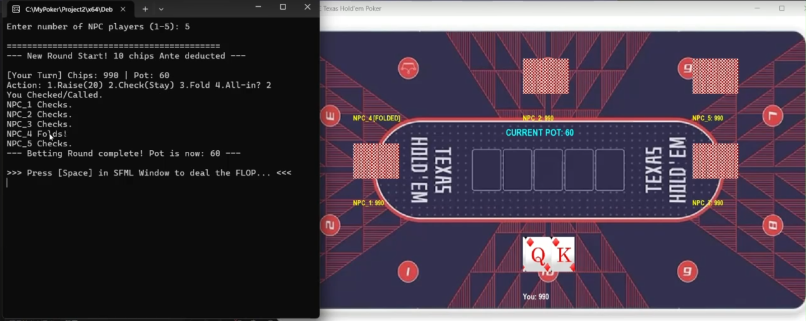
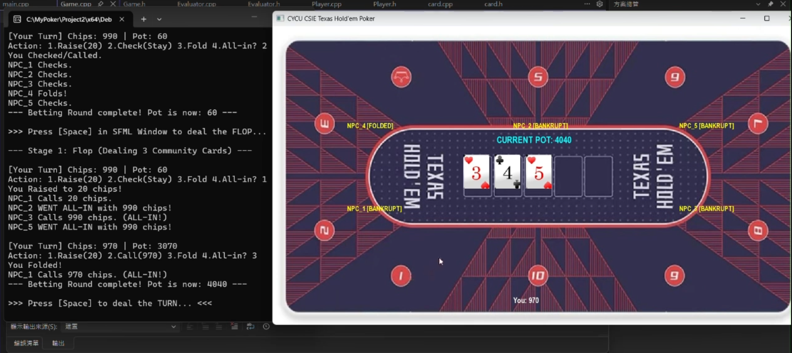
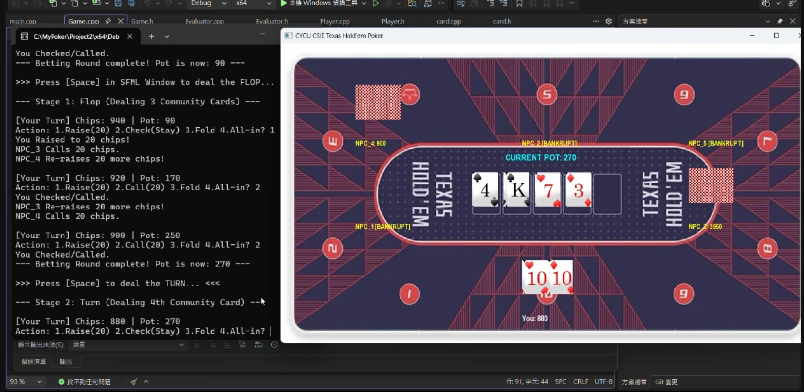
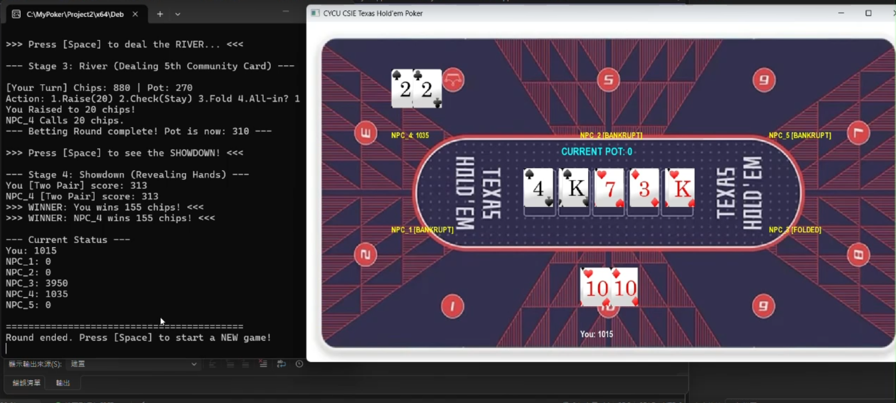

# 德州撲克

這是一款結合命令列互動與 2D 圖形介面的德州撲克遊戲，專為 C++ 物件導向程式設計課程開發。玩家可以在虛擬牌桌上與 1 至 5 位 NPC 進行德州撲克對戰，系統具備完整的發牌、下注、牌型判定與籌碼結算功能。

---

## 1. 組別資訊
* **組別號碼**：第15組
* **系級班級**：資工1A

## 2. 組員資訊
* **組長** : 郭育宏
* **組員** : 吳宥均
* **組員** : 張舜凱

## 4. 系統功能說明
* **動態玩家設定**：開局可選擇 1 至 5 位 NPC 加入牌局。
* **雙介面互動**：使用 SFML 呈現精美的虛擬牌桌、撲克牌圖形與目前籌碼狀態；同時透過終端機進行詳細的下注操作。
* **完整的德州撲克規則**：實作 Pre-flop、Flop、Turn、River 與 Showdown 五個階段。
* **自動牌型判定**：自動結算所有玩家手牌與公牌的最佳組合，精準判定高牌至同花順等牌型並分配彩池。
* **NPC 隨機行為**：NPC 具備基本的隨機決策邏輯。

## 5. 程式介紹

### 核心類別與方法說明
* **`Game` 類別**：遊戲主控制中心。
  * `startNewRound()`：初始化牌局、洗牌並扣除底注。
  * `bettingRound()`：處理玩家與 NPC 的下注邏輯、更新彩池。
  * `proceedToNextStage()`：控制遊戲推進至下一階段。
  * `determineWinner()`：呼叫判定系統並分配籌碼給贏家。
* **`Player` 類別**：管理單一玩家狀態。
  * 儲存玩家名稱、籌碼 (`chips`)、當前下注額 (`roundBet`) 以及狀態 (`folded`, `allIn`)。
  * `bet()`：處理扣除籌碼並加入彩池的邏輯。
* **`Card` 類別**：撲克牌實體。
  * 儲存花色 (`suit`) 與點數 (`rank`)。
  * `render()`：透過 SFML 的 `sf::Sprite` 根據牌面狀態（正面/背面）切割並繪製對應的撲克牌材質。
* **`Evaluator` 類別**：靜態工具類別，處理複雜的勝負判定。
  * `getScore()`：接收玩家手牌與公牌，統計同花 (`suitCounts`) 與順子 (`uniqueRanks`)，並回傳對應的牌型權重分數。

### 核心架構簡述
系統採用 **MVC (Model-View-Controller) 的概念變體** 進行設計。資料模型 (`Player`, `Card`) 負責存放狀態；視覺呈現 (`sf::RenderWindow`, `render`) 處理視圖；而 `Game` 與 `main.cpp` 的事件迴圈 (Event Loop) 則作為控制器，藉由按下空白鍵 (`[Space]`) 觸發狀態機推進，將邏輯與繪圖分離，提高程式的擴充性。

## 6. 程式使用方式
1. 執行程式後，請先在**命令列** 輸入你想對戰的 NPC 數量 (1-5)。
2. 接著會跳出 SFML 的圖形化遊戲視窗。
3. **推進遊戲**：在圖形視窗中按下鍵盤的 **`[Space]` (空白鍵)** 來進行發牌或進入下一階段。
4. **下注操作**：輪到你行動時，請回到**命令列視窗**，根據提示輸入對應的數字進行操作：
   * `1`：加注 (Raise)
   * `2`：過牌 / 跟注 (Check / Call)
   * `3`：棄牌 (Fold)
   * `4`：全下 (All-in)
5. 每局結束後，再次按下 `[Space]` 即可開啟新的一局，直到玩家破產 (Bankrupt)。

## 7. 程式安裝與環境建置方式

### 依賴環境
* **作業系統**：Windows
* **編譯器**：支援 C++14 或以上版本 (建議使用 Visual Studio)
* **第三方套件**：[SFML (Simple and Fast Multimedia Library) v2.5.1](https://www.sfml-dev.org/)

## 8. 運行畫面截圖

**初始畫面**

**第一次翻牌**

**第二次翻牌**

**第三次翻牌**

## 9. UML圖

## 10. 分工資訊
*  **郭育宏** : Readme製作、生成程式、PPT製作。
*  **吳宥均** : 生成程式、PPT製作、UML圖。
*  **張舜凱** : 
  
